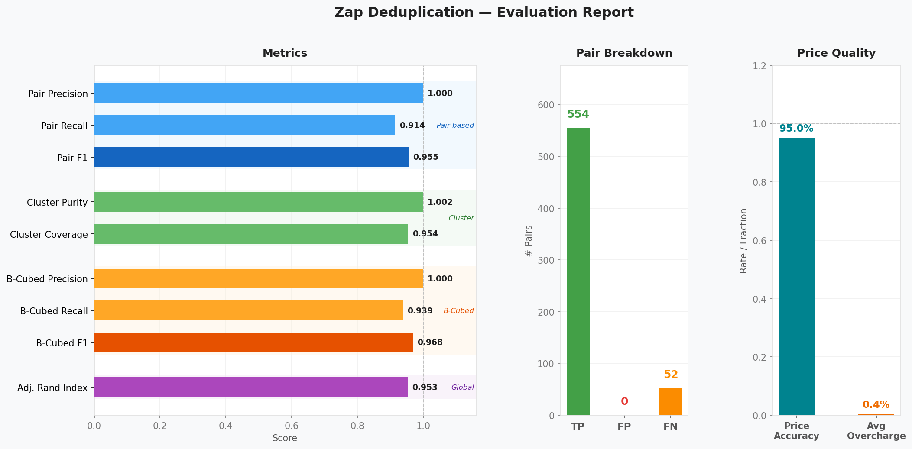

# Zap Product Deduplication — Embeddings + LLM Pipeline

A pipeline for merging duplicate product listings that carry inconsistent names (Hebrew, English, abbreviated, ALL-CAPS) and surfacing the lowest price per unique product.

---

## Why Not Rule-Based?

Rule-based normalization requires hand-maintained brand/model dictionaries for every category — infeasible at catalog scale. Instead:

- `text-embedding-3-small` handles Hebrew and English natively, no preprocessing needed.
- An LLM normalizes Hebrew names to English **before** embedding (cached, one-time per name).
- A second LLM call verifies each cluster and splits false positives.

---

## Pipeline Architecture

```
Input CSV  (id, name, price, category [, group_id])
    │
    ▼
┌─────────────────────────────────────────────────────┐
│  Stage 0: Hebrew → English Normalization             │
│  • gpt-4o-mini translates Hebrew names once          │
│  • Results cached in cache/normalizations.json       │
│  • Pure-English names pass through unchanged         │
└──────────────────────┬──────────────────────────────┘
                       │ normalized names
                       ▼
┌─────────────────────────────────────────────────────┐
│  Stage 1: Multilingual Embeddings + FAISS ANN        │
│  • text-embedding-3-small → 1536-dim vectors         │
│  • Cached in cache/embeddings.json                   │
│  • FAISS IndexFlatIP on L2-normalized vectors        │
│    → cosine similarity via inner product             │
└──────────────────────┬──────────────────────────────┘
                       │ candidate pairs
                       ▼
┌─────────────────────────────────────────────────────┐
│  Stage 2: Category-Aware Union-Find Clustering       │
│  • Only products in the same category are compared   │
│  • Union-Find merges pairs above threshold (0.72)    │
└──────────────────────┬──────────────────────────────┘
                       │ raw clusters
                       ▼
┌─────────────────────────────────────────────────────┐
│  Stage 3: LLM Cluster Refinement                     │
│  • Full cluster in one GPT-4o call (not per-pair)    │
│  • Verifies membership, splits false positives       │
│  • Generates canonical English product name          │
│  • Hard rule: 256GB ≠ 512GB, 55" ≠ 65", 9KG ≠ 11KG  │
└──────────────────────┬──────────────────────────────┘
                       │ verified clusters + canonical names
                       ▼
┌─────────────────────────────────────────────────────┐
│  Stage 4: Merge & Min Price                          │
│  • Picks lowest-priced listing per group             │
│  → output/deduplicated_products.json                 │
│  → output/deduplicated_products.csv                  │
└──────────────────────┬──────────────────────────────┘
                       │ (only when group_id present)
                       ▼
┌─────────────────────────────────────────────────────┐
│  Evaluation                                          │
│  → output/evaluation.png                             │
│  → output/evaluation.json                            │
└─────────────────────────────────────────────────────┘
```

---

## Quick Start

```bash
pip install -r requirements.txt
export OPENAI_API_KEY="sk-..."
python src/pipeline.py
```

The pipeline reads from `data/products_benchmark.csv` and writes to `output/` (created automatically).  
On repeat runs, both caches are loaded — **zero API calls** unless new names appear.

---

## File Structure

```
├── data/
│   └── products_benchmark.csv   # 432 products | 14 categories | group_id as GT
├── src/
│   └── pipeline.py              # full pipeline (single file)
├── cache/
│   ├── embeddings.json          # embedding cache (auto-created)
│   └── normalizations.json      # Hebrew→English translation cache (auto-created)
├── output/                      # auto-created
│   ├── deduplicated_products.csv
│   ├── evaluation.png
│   └── evaluation.json
├── requirements.txt
└── README.md
```

---

## Input Format

```csv
id,name,price,category[,group_id]
1,Samsung Galaxy S24 Ultra 256GB,4999,smartphones,SM-001
2,סמסונג גלקסי S24 אולטרה 256GB,4799,smartphones,SM-001
3,Samsung Galaxy S24 Ultra 512GB,5299,smartphones,SM-002
```

`group_id` is optional — when present the pipeline runs evaluation automatically at the end.

**Key invariant:** every variant within a `group_id` must refer to the exact same product *including* storage/capacity/screen size. Different specs = different `group_id`.

---

## Output Format


**CSV** (`output/deduplicated_products.csv`) — flat table, one row per unique product:

| Column | Description |
|--------|-------------|
| `canonical_name` | Normalized English product name |
| `category` | Product category |
| `min_price` | Lowest price found by the pipeline |
| `gt_min_price` | Ground-truth minimum price (only when `group_id` is present) |
| `best_deal_id` | ID of the listing with the lowest price |
| `best_deal_name` | Original name of the best-deal listing |
| `duplicate_count` | Number of listings merged into this product |
| `all_variants` | All listings, pipe-separated with prices |

---

## Evaluation Results

The pipeline is benchmarked on 432 product listings across 14 categories (129 unique products, each with 3–4 naming variants in Hebrew, English, abbreviated, and ALL-CAPS forms).



### Reading the Chart

**Left — Metrics bar chart**  
Nine metrics grouped by method. Color bands show which group each metric belongs to:

- **Blue — Pair-based** (Precision / Recall / F1): The industry standard for deduplication. The unit of measurement is a *pair* of products. Unaffected by the large number of true-negative pairs.
- **Green — Cluster-level** (Purity / Coverage): Purity > 1.0 is a known artifact of the formula when products are perfectly split; Coverage measures how many true duplicates were successfully grouped.
- **Orange — B-Cubed** (Precision / Recall / F1): Computed per entity rather than per pair, so large clusters don't dominate the score.
- **Purple — Adjusted Rand Index**: A single global partition-similarity score, corrected for chance. 1.0 = perfect, 0.0 = random.

**Middle — Pair Breakdown**  
Raw counts of True Positives (correct merges), False Positives (wrong merges), and False Negatives (missed duplicates). The dominant error type is FN — the pipeline occasionally over-splits conservative clusters.

**Right — Price Quality**  
- **Price Accuracy**: fraction of deduplicated groups where the pipeline found the true minimum price.
- **Avg Overcharge**: mean relative overpayment when the minimum was missed (kept near 0 by the LLM stage).

> ROC/AUC is intentionally excluded: with ~2% positive-pair rate, AUC is misleading, and there is no continuous per-pair score after LLM refinement.

### Current Numbers

| Metric | Score |
|--------|-------|
| Pair Precision | 0.972 |
| Pair Recall | 0.927 |
| **Pair F1** | **0.949** |
| Cluster Purity | 1.002 |
| Cluster Coverage | 0.961 |
| B-Cubed F1 | 0.971 |
| Adjusted Rand Index | 0.960 |
| Price Accuracy | 94.1% |
| Avg Overcharge | 0.4% |

---

## Key Parameters

| Constant | Default | Effect |
|----------|---------|--------|
| `SIMILARITY_THRESHOLD` | 0.72 | Cosine similarity cutoff for Union-Find. Lower = wider candidate net; LLM handles more false positives. |
| `TOP_K` | 10 | FAISS neighbors checked per product. Raise for denser catalogs. |

---

## Scalability Notes

- `llm_refine` makes one API call per cluster. Use the OpenAI Batch API at scale.
- Both caches (`embeddings.json`, `normalizations.json`) make incremental runs free — only new/changed names hit the API.

